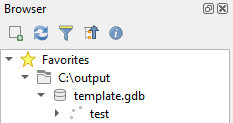

# filegdb-web-builder

+ A simple Spring Boot application that allows users to configure a file geodatabase template from a web browser or with
  the provided API.

## build

+ If using Windows you can execute `dockerRebuild.bat` then `dockerRun.bat`
+ Otherwise:
    + `gradle build`
    + `docker build . -t filegdbwebbuilder/filegdbwebbuilder:0.0.1-SNAPSHOT`
    + `docker run -p8080:8080 --name filegdbwebbuilder filegdbwebbuilder/filegdbwebbuilder:0.0.1-SNAPSHOT`

## useage

+ Once the application is running, requests are made to the `/api/filegdb` endpoint
  + A small example request might look like this:
    + ```
      {
        "name": "template", -- output file template name
        "featureLayers": [        -- list of feature layers
          {
            "name": "test",       -- name of each layer
            "geometryType": 1,    -- define layer geometry type
            "layerFields": [      -- list of layer fiels
                {
                 "name" : "testField",  -- define field name
                 "type": 1              -- define field type
                }
            ]
          }
        ],
        "spatialReferenceCode": 9000  -- define spatial reference for all layers
      }
      ```
 + The response contains a base64 encoded string that represents a .zip file containing the file geodatabase template
   + `{ "templateBase64": "UEsDBBQACAgIAIiNP1gAAAA..." }`
   

 + Extract the output with some other function:
   + ```
     def decode_base64_and_extract_zip(encoded_string, output_path='output'):
       decoded_bytes = base64.b64decode(encoded_string)
       with zipfile.ZipFile(io.BytesIO(decoded_bytes), 'r') as zip_ref:
         zip_ref.extractall(output_path)
     ```
     
   
     *Viewing in QGIS browser*
   
#### spatial references
+ As of now the spatial reference system must be defined with an official [EPSG](https://epsg.io/) code
+ The spatial reference system is currently applied to all layers in the file .gdb output per ESRI conventions
+ Once dataset support is added, each dataset can define spatial reference system for its layers

#### geometry types
+ 1 - `point`
+ 2 - `line`
+ 3 - `polygon`

#### field types
+ TBD

#### GDAL build info
+ The main application dependency is [GDAL](https://gdal.org/) 3.7 which has been pre-compiled using Ubuntu 22.04 into a compact version and placed in the top
level directory (see `gdal_install`)
+ If you wish to use your own custom GDAL build, you can use the `buildgdal.sh` script (you will need to adjust the script
for your own parameters.)
